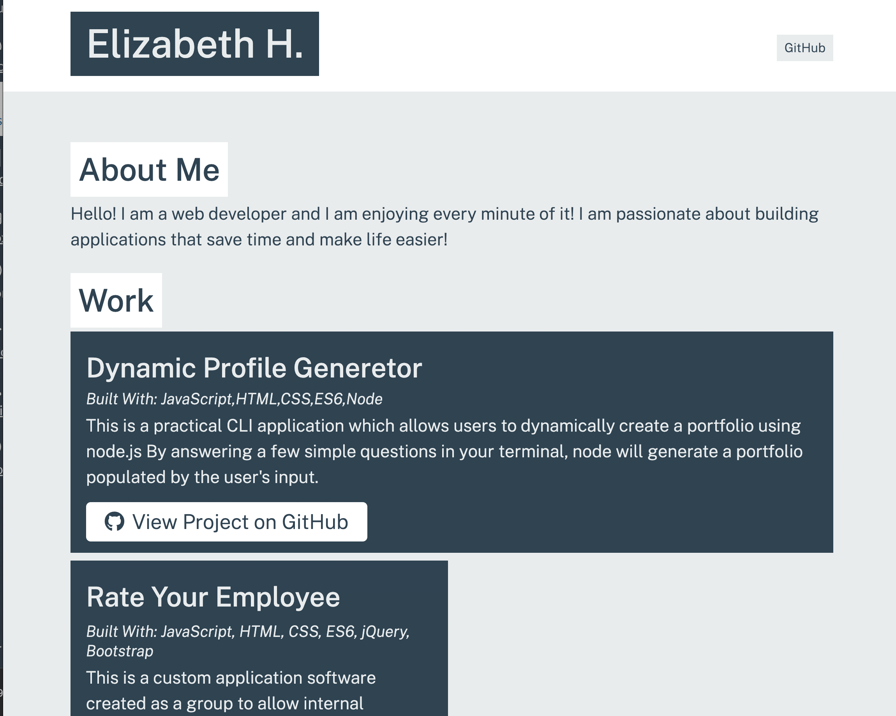

# Portfolio-Generator

## a Node.JS CLI application

- Through the functionality of Inquirer, user is prompted to answer some questions in your terminal.
- Your answers to these questions will help populate a dynamically generated Portfolio
- with the ability to add your projects as well as links to github!

**Linked Here: [Dynamic Portfolio Generator!](https://github.com/dragon-stark/Portfolio-Generator)**

